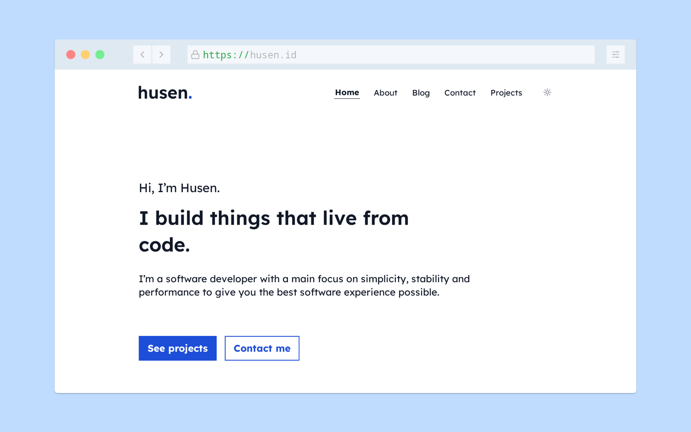

# My Website

[
](https://github.com/heyhusen/website/actions/workflows/main.yml)
[](LICENSE)

The sixth iteration of [husen.id](https://husen.id), built with
[Astro](https://astro.build/) and hosted on
[Cloudflare Pages](https://pages.cloudflare.com/).



<!-- To better understand why I migrate my website this time, you can read the
article [here](https://husen.id/article/2022/04/02/redesign-my-personal-website-using-hugo/). -->

## Prerequisites

- **Node** - v22 or higher.
- **pnpm** - v9 or higher.

> The easiest way to run this project locally is to use a
> [devcontainer](https://containers.dev/).

## Set-up

1. Install dependencies.

   ```bash
   pnpm install
   ```

2. Start the development server and try open <http://localhost:4321> on your web
browser.

   ```bash
   pnpm dev
   ```

### Production

1. Generate static website.

   ```bash
   pnpm build
   ```

2. Preview the production build.

   ```bash
   pnpm preview
   ```
