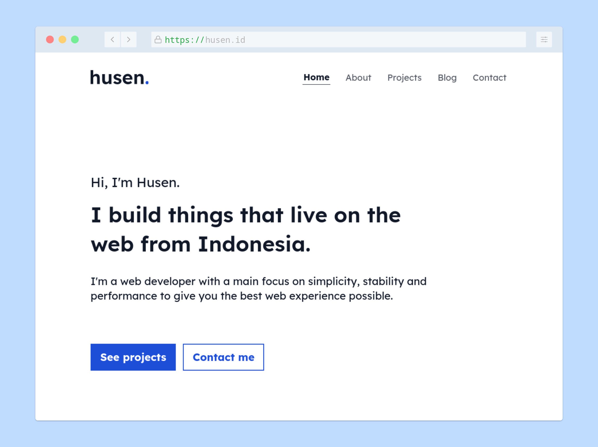

# husen.id

[](https://github.com/hapakaien/website/actions/workflows/main.yml)
[](LICENSE)

The fifth iteration of [husen.id](https://husen.id), built with
[Hugo](https://gohugo.io/) and hosted using
[Cloudflare Pages](https://pages.cloudflare.com/).



To better understand why I redesigned my website this time, you can read the
article [here](https://husen.id/article/2022/04/02/redesign-my-personal-website-using-hugo/).

## Prerequisites

- **Go** - v1.18 or higher.
- **Hugo** - v0.96.0 or higher.
- **Node** - v16 or higher.
- **pnpm** - v6 or higher.

## Set-up

1. Install dependencies.

   ```bash
   pnpm install
   ```

2. Start the development server and try open <http://localhost:3000> on your web
browser.

   ```bash
   pnpm dev
   ```

### Production

1. Generate static website.

   ```bash
   pnpm build
   ```

2. Preview the production build.

   ```bash
   pnpm start
   ```
